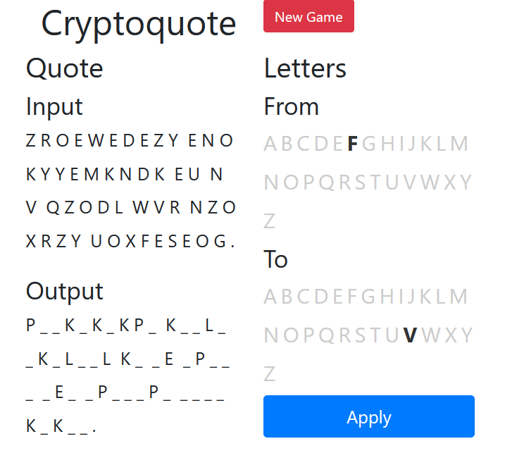

# Cryptoquote

The project is a cryptoquote game. Replace the letters to find the hidden message.

The messages are scraped from [SmartWords.org](https://www.smart-words.org/quotes-sayings/famous-one-liners.html) and shuffled when the game starts.

# Bonus

While not a requirement of the assignment, this project uses zero JavaScript. The UI appears dynamic using nothing but CSS.

# Live Demo

The project is deployed on Heroku here: https://cryptoquote-python.herokuapp.com/
